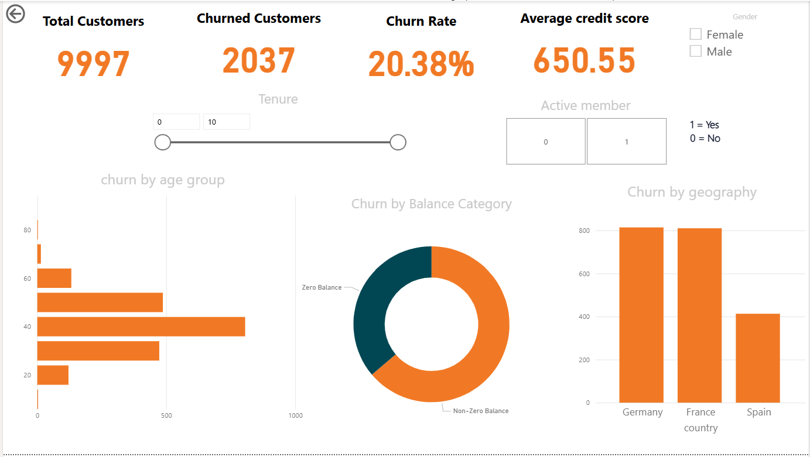

# Customer Churn Analysis

This project focuses on understanding customer churn behavior in a European bank. The main objective is to identify key patterns and insights about customers who leave the bank, using exploratory data analysis (EDA) and an interactive Power BI dashboard.

## Project Objective

The goal of this project is to:
- Analyze customer data to understand churn behavior.
- Identify trends related to geography, age, gender, credit score, account balance, and other customer features.
- Build a dashboard that communicates insights clearly to stakeholders.

## Dataset Overview

The dataset contains information on **9,997 customers** of a European bank. It includes details such as:
- Demographics (Age, Gender, Geography)
- Account details (Credit Score, Balance, Tenure, Number of Products)
- Customer activity (Is Active Member, Has Credit Card)
- Target variable: `Exited` (indicates if the customer churned)

## Tools & Technologies Used

- **Python** (Pandas, NumPy, Matplotlib, Seaborn) for data cleaning and exploratory analysis.
- **Power BI** for building an interactive dashboard.
- **Jupyter Notebook** for EDA and data preparation.

## Files Included

- `data_cleaning.ipynb`: Data cleaning using Python.
- `eda.ipynb`: Exploratory Data Analysis.
- `customer_churn_cleaned.csv`: Cleaned version of the dataset.
- `customer_churn_dashboard.pbix`: Power BI dashboard file.
- `customer_churn.png`: Dashboard screenshot for quick preview.
- `customer_churn_dictionary.csv`: Details of each column in the dataset.
- `customer_churn_raw.txt`: Project summary and description.

## Dashboard Insights

The Power BI dashboard provides a visual summary of:
- Total customers and churned customers.
- Churn rate and average credit score.
- Filters for gender, active membership, and tenure.
- Churn distribution by:
  - Age groups
  - Balance category (zero vs non-zero)
  - Geography (Germany, France, Spain)

## Key Findings

- The churn rate is around **20.38%**.
- Customers with a **zero balance** or from certain **geographies** are more likely to churn.
- Certain **age groups** show higher churn tendencies.
- The **average credit score** is approximately **650.55**.

## Future Improvements

- Add predictive modeling to forecast churn.
- Deploy the dashboard online for easier access.
- Automate data refresh in Power BI for real-time insights.

---

This project is a step towards building stronger customer retention strategies using data-driven insights.
